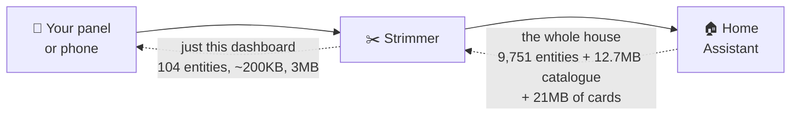

  

## 🚀 TL;DR

### Your Home Assistant dashboards are slow because every page loads *your entire house*.

Open a dashboard showing four lights and Home Assistant sends the browser **every entity you
own**, a catalogue of every device and area in the house, and every custom card you have ever
installed — then streams changes to all of it, forever. This app sits in front of Home Assistant
and sends each dashboard **only what it actually shows**. Same HA, same dashboards, same cards.

| | |
|---|---|
| 🖥️ **Wall panel** | dashboard appears in **60 s → 16 s** |
| 📱 **Phone on 4G** | **8.6 s → 3.3 s**, and ~5 MB less mobile data *per page load* |
| 📡 **Weak cellular** | **47 s → 18 s** |

| | |
|---|---|
| 📦 **Install it** | **[Installation guide →](docs/INSTALL.md)** — about five minutes on HA OS, or a plain Docker container |
| ⚙️ **Configure it** | **Point and click in the app's own sidebar panel** — tiles and pickers, not YAML — or **[every option, described →](strimmer/DOCS.md)** |
| 📈 **Check the numbers** | **[Full method and raw runs →](docs/PERFORMANCE.md)** |
| 🔀 **Upgrading an existing config** | **[Migration guide →](docs/MIGRATING.md)** — nothing is required; every old option name and override list still works |
| 🔌 **Build a client against it** | **[Client status API →](docs/CLIENT-API.md)** — how a panel reads trimmer status and its own stats, for ha-paneld, Kiosk Satellite and friends |

---

## 🧬 This is a fork

Strimmer began as a fork of **[HA WebSocket Stripper](https://github.com/GabrielGoldsteinAnidea/HA-Websocket-Stripper)**
by **[Gabriel Goldstein](https://github.com/GabrielGoldsteinAnidea)**, and the core idea is his:
put something in front of Home Assistant so a dashboard is sent only the entities it actually
shows. Everything below is built on that. Same MIT licence, same approach, same add-on — this
version just goes further.

Eight of the changes here are open as pull requests on the original, so some of it may find its
way back there in time.

### What this version adds

- 📇 **It trims the name and area catalogue too, not just entity states.** On a big install this
  list of every entity, device and area in the house is the single largest thing a dashboard
  downloads — bigger than the states themselves.
- 🎨 **Custom cards are sent per dashboard.** A panel showing two lights stops downloading every
  card you have ever installed.
- 🗣️ **Translations, service lists, themes and the Repairs backlog can be trimmed as well.** None
  of these appear on screen, and together they are hundreds of kilobytes on every single page load.
- 🖥️ **Each dashboard gets only its own entities**, instead of the combined total for all of them.
  A kiosk showing one room no longer pays for the rest of the house.
- 👤 **Rules for a person, a dashboard, or one specific panel.** "I see software updates, the
  kitchen panel doesn't" is something you can simply set.
- 📊 **A statistics page in your sidebar** showing what is being trimmed and what every panel is
  receiving right now — with a search box to find an entity a card is missing and send it
  **without restarting anything**.
- 🎛️ **Settings you can click, in that same panel.** Every on/off setting is one tile in a grid at
  the top — blue is on — so what the app is doing reads at a glance; every list is a list you add
  to and remove from. No YAML unless you want it. It takes over an option only when you actually
  change one there, so anything you already set keeps working exactly as it did.
- 🧩 **Override rules you build with a wizard**, not by hand. Match on a dashboard, a person, a
  **role** ("administrators see software updates, whoever they are"), how someone signed in, the
  kind of device a panel announces itself as, or which address it arrived on — and combine them.
  Entity and device fields search as you type.
- 🖨️ **Cards set up with a device just work** — including devices made of other devices, like a
  3D printer with its filament units, or a hub with its sensors.
- 📈 **Months of history, not minutes.** Around fifteen measurements are published as ordinary
  Home Assistant sensors, so you can graph them like anything else in your house.
- 🔎 **Panels name themselves** on the statistics page — "Office Panel (Kiosk Satellite)" rather
  than an IP address.
- 🧯 **It tells you when it has gone too far.** If trimming would stop a card rendering, that is
  written to the log by name, rather than leaving you with a blank square and no explanation.
- ✅ **Nothing ships untested.** Every change runs 398 automated tests, on the exact runtime the
  add-on ships with.

---

## ⚡ The difference

Measured on a Sonoff NSPanel Pro (a genuinely slow wall panel) against a Home Assistant
with **9,751 entities**:

| | 😴 Without | 🚀 With | 📉 |
|---|---|---|---|
| **Dashboard appears in** | 60 seconds | **16 seconds** | **73%** faster |
| Entities sent to the page | 9,751 | **104** | **98.9%** |
| 📇 Name/device/area catalogue | 12.7 MB | **~200 KB** | **98.5%** |
| 🎨 Custom card code | 21 MB | **3 MB** | **86%** |
| 🔌 Entity states | 2.5 MB | **112 KB** | **96%** |
| ⚙️ Service list | 196 KB | **~43 KB** | **78%** |
| Data per hour, just sitting there | ~17 MB | **~0.5 MB** | **97%** |

**≈ 4× faster**, and the panel stops thrashing.

### 📱 And on a phone, where it matters most

The wall-panel table above is dominated by *parsing* 5.8 MB of JSON. On cellular, payload size
turns straight into waiting. Headless Chrome, same dashboard, timed to the first `<ha-card>`:

| Link | 😴 Untrimmed | 🚀 Trimmed | | Time saved |
|---|---|---|---|---|
| **Weak cell** (1.5 Mbps, 150 ms) | 47.1 s | **18.4 s** | **2.6× faster** | **−28.7 s** |
| **4G** (9 Mbps, 40 ms) | 8.6 s | **3.3 s** | **2.6× faster** | **−5.4 s** |
| **Unthrottled LAN** | 0.66 s | **0.43 s** | **1.5× faster** | −0.23 s |

Websocket payload **5,799 KB → 844 KB**. The frontend bundle is untouched.

**[Every run, the validity checks, the limitations, and a benchmark that said the opposite for an
hour → `docs/PERFORMANCE.md`](docs/PERFORMANCE.md)** — reproduce it with
[`tools/bench-dashboard-load.mjs`](strimmer/tools/bench-dashboard-load.mjs).

### 📅 Now scale that to a day

Per-load numbers are easy to shrug at. The same numbers over 24 hours are not.

One wall panel, connected all day, reloading ten times (screensaver wake, app restart,
network blip):

| | 😴 Without | 🚀 With |
|---|---|---|
| 10 page loads *(catalogue + states + services)* | 154 MB | **3.6 MB** |
| 24 h of live updates | 408 MB | **12 MB** |
| **One panel, one day** | **≈ 562 MB** | **≈ 16 MB** |
| **Five panels, one day** | **≈ 2.8 GB** | **≈ 78 MB** |

**That's ~36× less — more than half a gigabyte a day, per panel, that never leaves Home
Assistant.** Every byte of it was assembled by your HA box, serialised to JSON, pushed over
the network, and parsed by a cheap wall tablet, so that it could be ignored.

> Custom-card JavaScript is left out of the day totals on purpose: browsers cache it, so the
> 21 MB → 3 MB is paid on first load rather than every load. It still matters — it is 18 MB
> the panel does not parse on a cold start, which is most of the 60 → 16 second gap.

---

## 🎁 What you get

- 🏃 **Dashboards that open in seconds**, not in "go and make a coffee"
- 📱 **~5 MB less mobile data per page load, and seconds off every open.** 5.8 MB of entity
  data down to 844 KB — 8.6 s → 3.3 s on 4G, 47 s → 18 s on a weak signal. If you check
  Home Assistant from outside the house, this is the headline
- 🔋 **Old tablets and wall panels become usable again** — no new hardware
- 🎨 **Nothing looks different.** It is your real Home Assistant frontend, your real
  cards, your real theme. Nothing is re-implemented or approximated
- 🧩 **No changes to your dashboards.** It works out what each one needs by reading it
- 🛟 **Fails safe.** If it is ever unsure, it sends *more*, not less
- 🎯 **Rules that follow the thing they belong to** — scope entities to a dashboard, to a
  person, or to a **physical device**. A wall panel running a browser voice satellite keeps
  its own entities wherever it navigates, and no other client pays for them
- 🔎 **Cards configured with a *device* work properly.** Some custom cards are set up by
  pointing at a device rather than at entities — a 3D printer card, a litter-robot card —
  and the device's entities are pulled in automatically instead of being stripped, which
  used to leave the card rendering blank with no error anywhere
- 📊 **A stats panel in your sidebar** that shows what it is actually doing — per-client
  payload sizes, what each dashboard costs, and where every byte went
- 🎛️ **And a settings tab in the same panel.** A grid of tiles for what to trim, searchable
  pickers for entities and devices, and a wizard for the override rules. YAML still works and
  still wins where you have used it
- 🐳 **Runs on plain Docker too**, if you have no Supervisor
- 🧱 **Running on a current, supported stack — and kept there.** Node 26 on Alpine, with
  [httpxy](https://github.com/unjs/httpxy) (the maintained unjs fork of node-http-proxy, and
  what `http-proxy-middleware` moved onto) rather than a proxy library last touched in 2024.
  Four direct runtime dependencies and **zero native bindings** — nothing here compiles, so
  there is nothing to rebuild when the runtime moves. The test suite runs on Node
  22, 24 and 26 on every push, the image build is smoke-tested before anything publishes, and
  Dependabot watches the dependencies so "current" does not quietly rot back into
  "end-of-life"
- 🤖 **Built with AI assistance — and proven on real hardware.** Every number above was
  measured on a live Home Assistant instance and a real wall panel, not estimated. The
  optimisations were AI-assisted, then tested against actual dashboards, tablets and
  devices until the stopwatch agreed

---

## 🔍 How it works, briefly

Home Assistant has no way to tell one dashboard *"only subscribe to what I show"*. This
adds exactly that, as a transparent proxy — so you point your kiosk at it instead of at
Home Assistant, and everything else stays the same.

It trims four separate payloads, and they are genuinely different things:

- 🔌 **Entity states** — what your things are doing, and the endless stream of changes
- 📇 **The catalogue** — the entity/device/area registries: what everything is *called* and
  where it lives. On a big install, quietly the largest download of the lot
- 🎨 **Custom cards** — so a panel stops parsing every card you ever installed
- ⚙️ **The service list** — every action every integration can perform *(opt-in)*

It also **turns compression back on**, which the app had previously been removing. Each
one is explained with examples further down.

---

## 🤔 What it will *not* fix

Being straight with you, because measuring this took a while:

- **It does not make Home Assistant's own frontend boot faster.** That is roughly 16
  seconds on a slow panel and this app cannot touch it. A dashboard with *one* card
  was no quicker than a full one
- **It is for kiosks and panels.** Send your admin browsing through it and
  Settings → Entities and Developer Tools will look oddly empty, because they genuinely
  expect everything. Keep a normal URL for that
- **It helps in proportion to your instance.** A few hundred entities? You will barely
  notice. A few thousand? Night and day

---

## 📓 Good to know

- The frontend JS bundles still load (and are cached after first visit); this targets the
  per-load entity firehose, which is the part that scales with instance size. Custom-card
  bundles can additionally be trimmed per dashboard with `trim_resources`, which is off by
  default — read the tuning section in `DOCS.md` first, because a wrongly dropped resource
  can fail *silently*.
- The allowlist **recomputes live** on dashboard edits and registry changes, and open kiosk
  pages reconnect themselves when it grows. Adding a whole new dashboard to the `dashboards`
  option still needs an app restart (options are read at boot).
- Each recompute logs the exact `+added` / `-removed` entity diff, so you can see from the
  app log what a dashboard edit changed.
- **Restarting Home Assistant is safe.** The app stays up and waits: HTTP degrades to 502
  while core is down, then it reconnects, rebuilds, and open dashboards recover on their own.
  Same at host boot, when the app starts before core is listening.
- Cards can still show "unavailable" if a filter type isn't supported yet — currently `not`,
  `and`, `or`, `floor`, `device_manufacturer`, `device_model`, `last_changed`. List those
  entities in `always_forward` and open an issue.
- A **local** app bakes the code into its image at build time, so updates need a
  **Rebuild**, not a Restart.
- See `CLAUDE.md` for architecture/decisions and `strimmer/DOCS.md` for option
  details.

## ☕ Credit & support

This is a fork of [GabrielGoldsteinAnidea/HA-Websocket-Stripper](https://github.com/GabrielGoldsteinAnidea/HA-Websocket-Stripper)
— the original idea and the hard part are Gabriel's. If it saved you an evening, a coffee is
appreciated.

## 🆕 What's new

Every release is written up in plain English, newest first:

**[`strimmer/CHANGELOG.md`](strimmer/CHANGELOG.md)**

